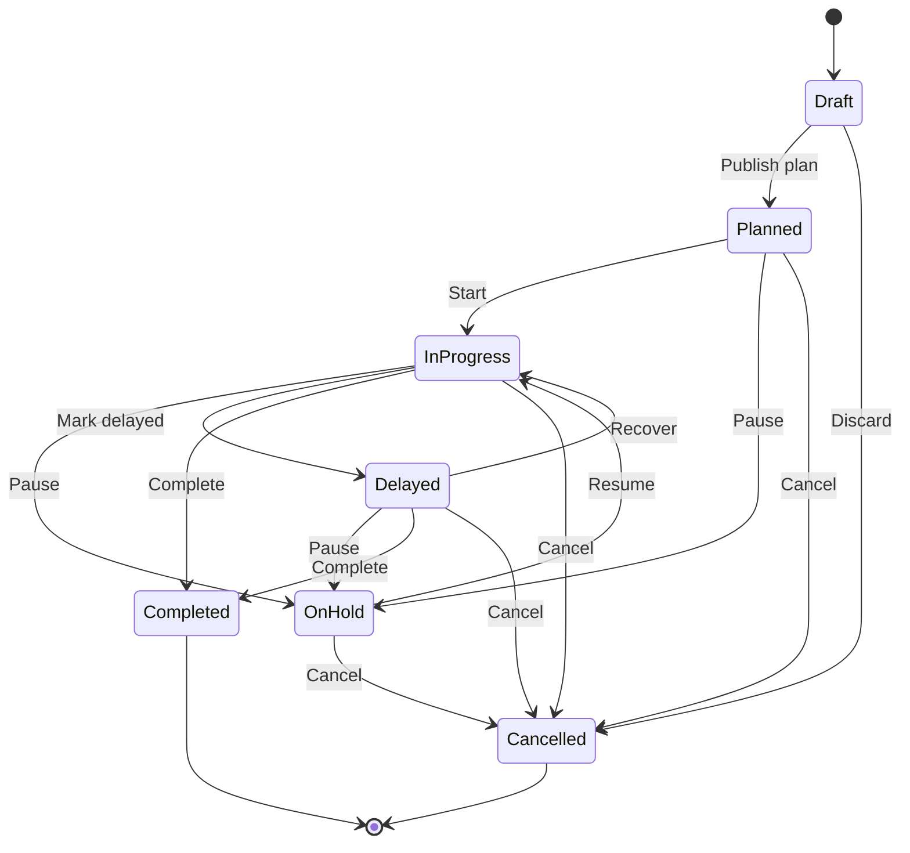
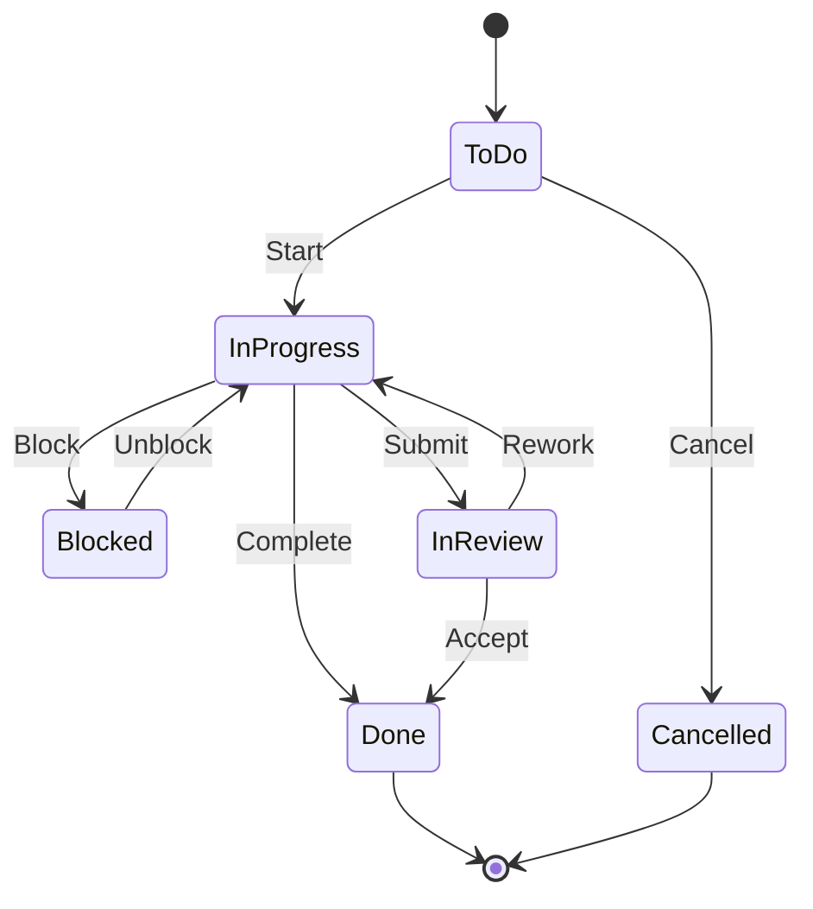
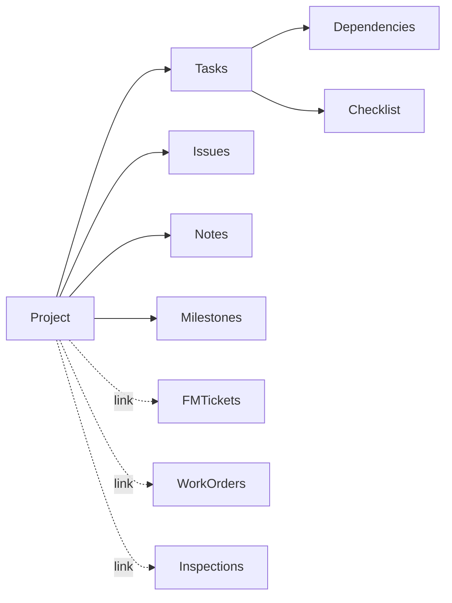
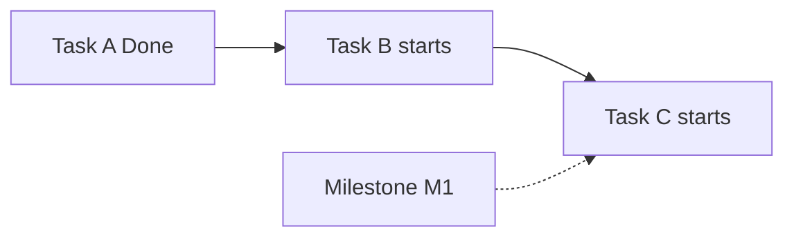
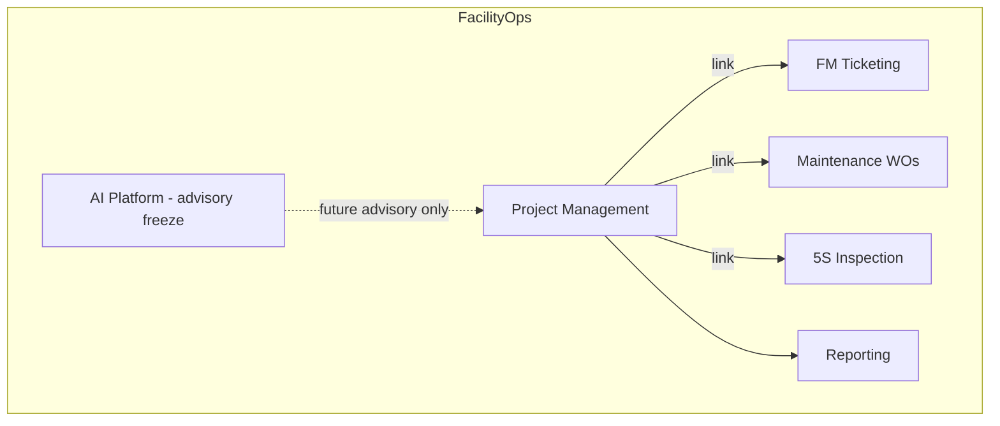

# PM-UX-001 — Project Management Workflow & UX Design

**Status:** COMPLETE AND MERGED (approved UX baseline via PM-UX-001A)
**Date:** 2026-08-06
**Type:** UX / Workflow Design / Documentation only
**Branch:** `docs/pm-ux-001-project-management` (deleted after merge)
**Base main (pre-merge):** `8cb18950f05aa8dada3b1896b9705228b7c89c3c`
**PR:** https://github.com/acarbonilla/facilityops-platform/pull/66
**AI Platform freeze:** `98c1661…` (RM-001 / AI Platform v1.0) — **FROZEN AND UNCHANGED**
**Implementation roadmap:** FO-103 through FO-109A (**not started**)
**Shared implementation branch (FO-103–FO-109):** `feature/project-management`

This document does **not** change production code, databases, APIs, or frontend.

---

## 1. Project Management Vision

### Purpose

Give FacilityOps a first-class **Project Management** module so facility teams can plan, execute, track, and close multi-task facility projects (renovations, upgrades, campaigns, corrective programs) inside the same tenant-scoped platform they already use for tickets, work orders, and inspections.

### Goals

1. Provide a clear project lifecycle from draft through completion/cancellation.
2. Support task assignment, dependencies, milestones, issues, and notes.
3. Visualize schedule via Timeline and Gantt without requiring a separate PM tool.
4. Track progress and accomplishment transparently for managers and members.
5. Link projects to existing FM Tickets, Maintenance Work Orders, and 5S Inspections.
6. Preserve FacilityOps architecture: tenant isolation, RBAC, attachments, notifications, reporting patterns.
7. Remain AI-advisory only — AI must never auto-mutate project status, dates, or ownership in v1.

### Business value

- Reduce spreadsheet/email project tracking.
- Improve visibility of delayed work and upcoming milestones.
- Connect operational incidents (tickets/WOs/inspections) to capital or program work.
- Create an auditable accomplishment trail for facilities leadership.

### Relationship with existing modules

| Module | Relationship |
| --- | --- |
| **FM Ticketing** | Projects may **link** tickets as related work or drivers; tickets remain authoritative for incident lifecycle. Project does not replace ticket status. |
| **Maintenance Work Orders** | Projects may link WOs as execution vehicles; WO assignment/SLA stay in Maintenance. |
| **5S Inspection** | Projects may link inspections as inputs or acceptance gates; inspection workflow stays in 5S. |
| **AI Platform** | Optional later advisory summaries (risk, delay signals). **Out of scope for FO-103–109** except placeholder UX hooks. AI Platform freeze remains intact. |
| **Reporting** | Project metrics feed a future reporting surface under `reporting.view` (FO-108/FO-109). |
| **Attachments / Notifications** | Reuse existing platforms; no parallel file or notification stacks. |

---

## 2. Module Scope

### Included (FO-103–FO-109)

- Projects list, dashboard, and detail
- Project lifecycle states
- Tasks, assignment, priority, due dates, checklists
- Task dependencies (finish-to-start MVP)
- Milestones
- Issues and notes
- Timeline activity feed
- Gantt chart (day/week/month zoom)
- Progress % (task → project rollup)
- Project ↔ Ticket / WO / Inspection links (reference links)
- Notifications for key events
- Project reporting cards / filters
- Permissions, tenant isolation, accessibility, responsive UX

### Excluded (v1)

- Full portfolio/program hierarchy (programs of projects)
- Native procurement, purchasing, or inventory
- Native budget/cost accounting (beyond optional note fields)
- Resource leveling / capacity planning engine
- External PM sync (MS Project, Jira, Asana)
- Real-time collaborative cursors
- Offline-first mobile app with sync
- AI auto-scheduling or auto-status changes
- Changing FM Ticket / WO / Inspection core workflows

### Future enhancements

- Weighted progress by effort
- Critical-path highlighting beyond basic dependency rules
- Budget and procurement modules
- Contractor portal
- Baseline vs actual schedule variance reporting
- Calendar export (ICS)
- Portfolio dashboards across many projects

---

## 3. User Roles

Roles map to FacilityOps RBAC patterns (permission codes; exact codes finalized in FO-103).

| Role | Intent |
| --- | --- |
| **System Administrator** | Tenant/platform configuration; can manage all projects when permitted; never bypasses tenant isolation. |
| **Facility Manager** | Operational authority; create/edit projects; approve completion; link modules; view all tenant projects. |
| **Project Manager** | Owns one or more projects; manage tasks, schedule, issues, notes, members; drive status. |
| **Project Member** | Assigned work; update own tasks; add notes/issues within project; limited schedule edit. |
| **Employee** | No project module access by default (continues using My Requests). Optional future: view linked ticket context only. |
| **Read-only User** | View projects/reports without mutating (e.g. leadership viewer). |

### Permission matrix (design intent)

| Capability | SysAdmin | Facility Manager | Project Manager | Project Member | Employee | Read-only |
| --- | --- | --- | --- | --- | --- | --- |
| View project list (tenant) | ✓ | ✓ | ✓ (assigned/owned + policy) | ✓ (member projects) | — | ✓ |
| Create project | ✓ | ✓ | ✓ (if granted) | — | — | — |
| Edit project metadata | ✓ | ✓ | ✓ (own/assigned) | — | — | — |
| Change project status | ✓ | ✓ | ✓ (own/assigned) | — | — | — |
| Manage members | ✓ | ✓ | ✓ | — | — | — |
| Create/edit any task | ✓ | ✓ | ✓ | Limited* | — | — |
| Update assigned task | ✓ | ✓ | ✓ | ✓ | — | — |
| Manage dependencies / Gantt edit | ✓ | ✓ | ✓ | — | — | — |
| Create issues/notes | ✓ | ✓ | ✓ | ✓ | — | — |
| Link tickets/WOs/inspections | ✓ | ✓ | ✓ | — | — | — |
| View reports | ✓ | ✓ | ✓ | Limited | — | ✓ |
| Delete/archive project | ✓ | ✓ | Policy | — | — | — |

\*Members may create subtasks only if project setting allows (default: no).

Proposed permission codes (FO-103): `projects.view`, `projects.create`, `projects.update`, `projects.manage`, `projects.report`.

---

## 4. Navigation

### Sidebar

Insert **Projects** in primary app navigation after Maintenance / before 5S (or after 5S — Decision Log prefers **after Maintenance**):

```text
Dashboard
My Requests
FM Ticketing
Maintenance
Projects          ← new (projects.view)
5S Inspection
Reporting
…
```

### Routes (design)

| Route | Purpose |
| --- | --- |
| `/projects` | Projects list + filters |
| `/projects/dashboard` | Cross-project dashboard |
| `/projects/new` | Create project |
| `/projects/[id]` | Project detail (Overview default) |
| `/projects/[id]/tasks` | Task board/list |
| `/projects/[id]/timeline` | Activity timeline |
| `/projects/[id]/gantt` | Gantt chart |
| `/projects/[id]/issues` | Issues |
| `/projects/[id]/notes` | Notes |
| `/projects/[id]/reports` | Project-scoped report cards |
| `/reporting/projects` | Optional reporting hub entry (FO-108) |

### Wireframe — Projects list

```text
┌──────────────────────────────────────────────────────────────┐
│ Projects                                    [ + New Project ]│
│ Filters: Status ▾  Owner ▾  Building ▾  Search ________      │
├──────────────────────────────────────────────────────────────┤
│ Name              Status        Progress  Due        Owner   │
│ Lobby Renovation  In Progress   ████░ 62% 2026-09-30  A. Lee │
│ HVAC Upgrade Q3   Delayed       ██░░░ 28% 2026-08-15  B. Kim │
│ 5S Campaign Wing B Planned      ░░░░░  0% 2026-10-01  C. Ong │
└──────────────────────────────────────────────────────────────┘
```

### Wireframe — Project dashboard (cross-project)

```text
┌──────────────────────────────────────────────────────────────┐
│ Project Dashboard                                            │
│ [Active] [Delayed] [Due soon] [My work]                      │
│ ┌────────┐ ┌────────┐ ┌────────┐ ┌────────┐                 │
│ │ Active │ │Delayed │ │Due 14d │ │Open    │                 │
│ │   12   │ │   3    │ │   5    │ │Issues 8│                 │
│ └────────┘ └────────┘ └────────┘ └────────┘                 │
│ Upcoming milestones | Workload by assignee | Recent activity │
└──────────────────────────────────────────────────────────────┘
```

---

## 5. Project Lifecycle

### States

| State | Meaning |
| --- | --- |
| **Draft** | Being set up; not visible in operational dashboards by default. |
| **Planned** | Approved plan; not started. |
| **In Progress** | Active execution. |
| **On Hold** | Intentionally paused. |
| **Delayed** | Past planned end or milestone breach (may be system-suggested + human confirm, or manual). |
| **Completed** | All required work done; accomplishment recorded. |
| **Cancelled** | Stopped without completion. |

### Transition rules (v1)

- `Draft → Planned | Cancelled`
- `Planned → In Progress | On Hold | Cancelled`
- `In Progress → On Hold | Delayed | Completed | Cancelled`
- `On Hold → In Progress | Cancelled`
- `Delayed → In Progress | On Hold | Completed | Cancelled`
- `Completed` / `Cancelled` are terminal (reopen only via Facility Manager + audit reason — FO-107 decision)

### Workflow diagram



---

## 6. Project Detail Layout

Default tab: **Overview**. Sticky header shows name, status badge, progress %, owner, primary dates.

```text
┌──────────────────────────────────────────────────────────────┐
│ Lobby Renovation   [In Progress]   Progress 62%              │
│ Owner: A. Lee   Start: 2026-06-01   Target: 2026-09-30       │
│ [Overview][Tasks][Timeline][Gantt][Issues][Notes][Reports]   │
├──────────────────────────────────────────────────────────────┤
│ Left column                      │ Right column              │
│ • Project information            │ • Progress ring / bar     │
│ • Milestones summary             │ • Open issues (top 5)     │
│ • Linked modules                 │ • Next milestone          │
│ • Recent timeline snippets       │ • Members                 │
│ • Attachments preview            │ • Quick actions           │
└──────────────────────────────────────────────────────────────┘
```

### Sections

| Section | Content |
| --- | --- |
| Overview | Status, health, progress, next milestone, blockers |
| Project Information | Code/name, building(s), dates, owner, description, tags |
| Milestones | List with due dates and completion |
| Tasks | Summary counts + link to Tasks tab |
| Progress | Rollup % and accomplishment notes |
| Issues | Open/critical count |
| Notes | Latest notes by type |
| Attachments | Reuse Attachments module ownership (`project`) |
| Linked Modules | Tickets / WOs / Inspections cards |
| Timeline | Embedded recent activity |

---

## 7. Task Workflow

### Task lifecycle

| State | Meaning |
| --- | --- |
| **To Do** | Not started |
| **In Progress** | Active |
| **Blocked** | Waiting on dependency/issue |
| **In Review** | Awaiting acceptance (optional) |
| **Done** | Complete |
| **Cancelled** | Not required |



### Task fields (v1)

- Title, description
- Assignee (single primary; multi-assignee deferred)
- Status, priority (`Low` / `Medium` / `High` / `Critical`)
- Start date, due date
- Estimated effort (optional hours; display only in v1)
- Checklist items
- Dependencies (predecessors, finish-to-start)
- Progress % (0–100; auto 0/100 on To Do/Done unless manual override enabled)
- Linked ticket / WO / inspection (optional)
- Attachments

### Assignment & completion

- Project Manager assigns; Member can reassign only if permitted.
- Completing a task requires checklist completion when checklist exists (configurable).
- Completing the last open required task does **not** auto-complete the project (human confirms).

---

## 8. Gantt Chart

### Behavior

- Horizontal time axis; rows = tasks + milestones.
- Bars show start–end; progress fill inside bar.
- Dependency arrows (finish-to-start MVP).
- Milestone diamonds.
- **Today** vertical marker.
- Delay: bar/end date past today while not Done → delayed styling (not color-only; include icon/text).
- Critical tasks: tasks on longest path **or** explicitly flagged (v1: explicit flag + simple dependency depth heuristic; full CPM optional later).

### Zoom levels

| Zoom | Use |
| --- | --- |
| Day | Short projects / intensive weeks |
| Week | Default |
| Month | Portfolio-length projects |

### Wireframe

```text
┌──────────────────────────────────────────────────────────────┐
│ Gantt   Zoom: (Day) (Week●) (Month)   [Today]  Legend        │
│ Task            │ Jun │ Jul │ Aug │ Sep │                    │
│ ▸ Design        │█████┤     │     │     │                    │
│   Specs         │██───┤     │     │     │ ──┐                │
│ ▸ Build         │     │████████████─────┤   │                │
│   Milestone M1  ◆─────┤     │     │     │◄──┘                │
│                 │     │    ↑ today                           │
└──────────────────────────────────────────────────────────────┘
```

### Interaction rules

- Drag resize/move: Project Manager+ only.
- Members: read-only Gantt unless granted `projects.update`.
- Invalid dependency cycles blocked with inline error.
- Keyboard: arrow navigate rows; Enter opens task drawer.

---

## 9. Timeline

Chronological feed of project activity (newest first or oldest first toggle; default newest first).

### Event types

- Progress updates
- Task created / status / assignee / due-date changes
- Project status changes
- Issue opened / resolved
- Milestone completed
- Photos/attachments added
- Notes / comments
- Module links added/removed

### Wireframe

```text
┌────────────────────────────────────────────┐
│ Timeline                    [Filter ▾]     │
│ ● Aug 6  Task “Install tiles” → Done       │
│ ● Aug 5  Issue “Supply delay” opened High  │
│ ● Aug 4  Photo added to Milestone M1       │
│ ● Aug 3  Status In Progress → Delayed      │
└────────────────────────────────────────────┘
```

---

## 10. Issues

Project issues are **project-scoped blockers/risks**, not FM Tickets. They may link to a ticket when an operational incident exists.

### Issue lifecycle

`Open → In Progress → Resolved → Closed` (+ `Cancelled`)

| Field | Values |
| --- | --- |
| Priority | Low / Medium / High / Critical |
| Status | Open / In Progress / Resolved / Closed / Cancelled |
| Resolution | Fixed / Won’t fix / Duplicate / Moved to ticket / Other |
| Escalation | Flag + notify Facility Manager |
| Blocking tasks | Multi-select tasks marked Blocked when linked |

Escalation does not auto-create tickets; user may “Create linked FM Ticket” as an explicit action (FO-108).

---

## 11. Notes

Typed notes for structured communication (not a chat replacement).

| Type | Use |
| --- | --- |
| General | Default |
| Site | Field conditions |
| Safety | Hazards / PPE / incidents (informational; not EHS system of record) |
| Decision | Decisions & owners |
| Inspection | Acceptance / punch references |
| Material | Materials / lead times |
| Contractor | Vendor coordination |

Notes support author, timestamp, optional pin, and attachments. Editable by author/PM within policy; soft-delete with audit.

---

## 12. Progress Tracking

### Task percentage

- Default: To Do = 0%, Done = 100%, In Progress/Blocked/In Review = manual 0–99 (default 50 on start — Decision Log).
- Checklist: optional auto % = completed/total checklist items when enabled.

### Project percentage

**v1 automatic calculation (simple average):**

\[
Project\% = \frac{\sum Task\%_{active}}{Count(active\ tasks)}
\]

- Exclude Cancelled tasks.
- Milestones do not contribute weight in v1 (completion is binary signal only).

### Future weighted progress

Defer effort/story-point weighting to post-FO-109. Document hook: `progress_mode = simple | weighted`.

### Accomplishment

On project **Completed**, capture:

- Completion date
- Completed by
- Summary accomplishment text (required)
- Optional photo set
- Snapshot of final progress % and open issue count (should be 0 critical, warn otherwise)

---

## 13. Linked Modules

Links are **references**, not ownership transfers.

| Link type | Behavior |
| --- | --- |
| FM Ticket | Open ticket detail in context; show number/status/priority |
| Maintenance WO | Open WO detail; show number/status |
| 5S Inspection | Open inspection; show status/score if available |
| Future Procurement | Placeholder section “Coming later” |
| Future Budget | Placeholder section “Coming later” |

Permissions: user must also pass target module view permission to open deep links; otherwise show metadata only or “no access”.



---

## 14. Notifications

Reuse FacilityOps notification platform (FO-055–060 patterns).

| Event | Audience |
| --- | --- |
| Task assignment | Assignee |
| Task completed | Project Manager + assigner |
| Task overdue | Assignee + Project Manager |
| Issue created | Project Manager (+ escalated FM) |
| Milestone completed | Project members (digest-friendly) |
| Project completed | Facility Manager + Project Manager + members |

No prompts, secrets, or unrelated PII in notification bodies. Employee role not in distribution unless explicitly a project member (rare).

---

## 15. Reporting

### Project Dashboard (module)

Cards: active, delayed, due in 14 days, open issues, my open tasks.

### Report views (FO-108)

| Report | Description |
| --- | --- |
| Delayed Projects | Status Delayed or past target end |
| Upcoming Milestones | Next 14/30 days |
| Project Progress | Distribution of % complete |
| Project Issues | Open/critical by project |
| Project Workload | Open tasks by assignee |

Respect `projects.report` / `reporting.view` (exact gating in FO-108). Export CSV optional later.

---

## 16. Mobile UX

| Surface | Phone | Tablet |
| --- | --- | --- |
| List / dashboard | Stacked cards | Two-column cards |
| Detail tabs | Horizontal scroll tabs | Full tabs |
| Tasks | List + detail sheet | List + side panel |
| Gantt | Read-only condensed; “Open desktop for edit” | Pinch zoom + pan |
| Timeline / notes / issues | Full support | Full support |

### Offline considerations

- v1: online-only; show clear offline banner if network lost mid-edit.
- Draft note caching deferred.
- No offline Gantt editing.

---

## 17. Accessibility

- Full keyboard access to lists, tabs, task drawer, and Gantt row navigation.
- Visible focus rings; skip link to project main content.
- ARIA: tabs, dialogs, live regions for status toasts, Gantt row labels.
- Status not by color alone (badges include text; delayed uses icon + label).
- Screen reader: announce progress as “62 percent complete”; dependency errors announced on save.
- Respect `prefers-reduced-motion` for Gantt animations.

---

## 18. Security

| Control | Rule |
| --- | --- |
| Tenant isolation | All project queries scoped by authenticated tenant; no cross-tenant IDs. |
| Permissions | Server-enforced `projects.*`; UI hides unauthorized nav. |
| Visibility | Members see member projects; managers see tenant projects per policy. |
| Cross-module auth | Linking does not grant ticket/WO/inspection access; deep link checks target perms. |
| Audit | Status changes, member changes, deletes soft-delete + audit fields. |
| Attachments | Existing attachment authorization + owner_type `project`. |

---

## 19. Mermaid Diagrams

### Navigation

```mermaid
flowchart TB
  Sidebar --> ProjectsList[/projects]
  ProjectsList --> Dashboard[/projects/dashboard]
  ProjectsList --> Detail[/projects/id]
  Detail --> Tasks
  Detail --> Timeline
  Detail --> Gantt
  Detail --> Issues
  Detail --> Notes
  Detail --> Reports
```

### Dependencies (finish-to-start)



### Module relationships



*(Project lifecycle and task lifecycle diagrams are in §§5 and 7.)*

---

## 20. Decision Log

| ID | Decision | Rationale | Trade-off |
| --- | --- | --- | --- |
| D1 | Docs-only PM-UX before FO-103 | Matches UX-001 success pattern | Implementation waits on approval |
| D2 | Projects nav after Maintenance | Keeps ops modules grouped | Slightly lower for inspection-led orgs |
| D3 | Issues ≠ Tickets | Avoid dual incident systems | Users must learn when to escalate to FM Ticket |
| D4 | Finish-to-start dependencies only in v1 | Simpler Gantt + validation | No start-to-start / lag UI yet |
| D5 | Simple average progress | Transparent, easy to QA | Uneven task sizes skew % |
| D6 | No AI auto-mutation | Protect AI Platform freeze & trust | Manual schedule maintenance |
| D7 | Links are references | Preserve module ownership | No cascade status from ticket→project |
| D8 | Delayed is first-class state | Visibility for leadership | Risk of overuse vs On Hold |
| D9 | Employee excluded by default | Intake path remains My Requests | Extra grant needed for rare member employees |
| D10 | Gantt edit PM+ only | Prevent schedule thrash | Members rely on task forms |
| D11 | Single shared implementation branch `feature/project-management` for FO-103–FO-109; only FO-109A merges to `main` | Reduces branch sprawl; one integration line | Longer-lived feature branch requires discipline |

### Deferred items

- Weighted progress, full CPM, multi-assignee, budget/procurement, offline sync, external PM integrations, portfolio hierarchy.

---

## 21. Roadmap

| ID | Task | Focus |
| --- | --- | --- |
| **FO-103** | Project Management Foundation | Models, permissions, list/create/detail shell, lifecycle |
| **FO-104** | Project Task & Assignment Management | Tasks, assignees, priority, due dates, checklists |
| **FO-105** | Gantt Chart & Task Dependencies | Gantt UI, FS dependencies, zoom, today/delay |
| **FO-106** | Timeline, Notes & Issues | Activity feed, note types, issue lifecycle |
| **FO-107** | Progress & Accomplishment Tracking | % rollup, accomplishment on complete |
| **FO-108** | FacilityOps Module Integration | Ticket/WO/Inspection links, reporting hooks, notifications |
| **FO-109** | Project Management QA & Production Readiness | Tests, a11y, security, performance |
| **FO-109A** | Finalize, Merge & Post-Merge Verification | Single merge of `feature/project-management` into `main` |

**Branching strategy (official after PM-UX-001A):**

- All FO-103 through FO-109 work lands on **`feature/project-management`**.
- Do **not** create per-task implementation branches (`feature/fo-103-…`, etc.).
- **FO-109A** is the only task that merges the complete Project Management feature into `main`.

Intelligent Employee Intake (FO-096–FO-101A) remains complete and separate; Project Management must not rewrite intake, AI Platform, ticket, WO, or inspection core workflows.

---

## 22. Acceptance Criteria

PM-UX-001 is accepted when:

1. Vision, scope, roles, and permission matrix are unambiguous for FO-103.
2. Navigation and routes are specified.
3. Project and task lifecycles include states, transitions, and Mermaid diagrams.
4. Detail layout, Gantt, timeline, issues, notes, and progress rules are implementable without redesign.
5. Linked-module and notification behaviors are defined.
6. Reporting, mobile, accessibility, and security expectations are stated.
7. Decision log and FO-103–FO-109A roadmap are complete (including shared feature-branch strategy).
8. Document is docs-only: **no** production code, migrations, APIs, or frontend changes in this task.
9. Trackers (`project-status`, `progress-map`, `work-tree`) updated.
10. Documentation merged to `main` via PM-UX-001A and established as the approved UX baseline.

---

## Explicit exclusions (PM-UX-001)

- No production application code changed.
- No database migrations.
- No API or frontend implementation.
- No FO-103+ coding in this branch.

---

## Document control

| Item | Value |
| --- | --- |
| Authoring task | PM-UX-001 |
| Follow-on design finalization | Optional PM-UX-001A (if needed) |
| Implementation start | FO-103 on `feature/project-management` |
| Finalization | [PM-UX-001A - Finalize, Merge & Post-Merge Verification.md](./PM-UX-001A%20-%20Finalize%2C%20Merge%20%26%20Post-Merge%20Verification.md) |
