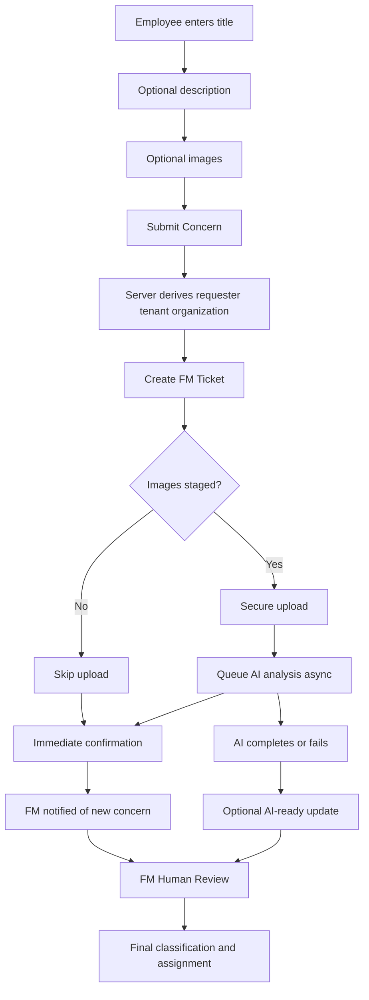
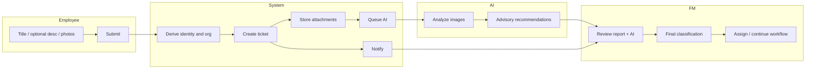

# UX-001 — Intelligent Employee Ticket Intake Design

**Status:** Draft Design (Draft PR)  
**Date:** 2026-08-05  
**Type:** UX / Workflow Design / Documentation only  
**Base:** `main` @ `60696d164c7f4449d201bd7bb99b8c772ad63187`  
**AI Platform freeze:** `98c1661…` (RM-001 / AI Platform v1.0)  
**Branch:** `docs/ux-001-intelligent-employee-intake`  
**Implementation:** FO-096 through FO-101 (**not started**)

## 1. Purpose

Define the future Intelligent Employee Ticket Intake experience before FO-096 implementation.

Employees report concerns with minimal friction. The system derives identity and ownership. AI provides advisory classification. Facility Managers retain final operational authority.

This document does **not** change production code.

## 2. Starting context reviewed

| Area | Current behavior | Key paths |
| --- | --- | --- |
| Employee create | `/my-requests/new` requires title, description, category, building; optional floor/area/asset/images | `frontend/app/(app)/my-requests/new/page.tsx`, `features/my-requests/components/my-request-create.tsx`, `lib/my-requests/form.ts` |
| Server ownership | Employee serializer forces tenant/organization/requester from authenticated user; rejects client ownership keys | `EmployeeFmTicketCreateSerializer` |
| Internal FM form | Full classification + location + priority + source | `features/fm-tickets/components/ticket-form.tsx` |
| Attachments / AI | Create ticket → upload images → queue AI only if attachments exist | FO-084 staging + `ai_queue_service` (`allow_empty=False`) |
| Human review | Accept / Modify / Ignore on internal ticket detail/edit | FO-087 `TicketAiAnalysisStatusPanel` |
| Notifications | No create/AI notifications today; assign & status-change only | `notification_service.py` |
| Model constraints | `category`/`priority`/`building` required (non-null); floor/area/asset nullable | `FmTicket` model |

## 3. Design principles

1. Employees report concerns; they do not classify operational work.
2. Authentication supplies requester identity.
3. Tenant and organization are derived server-side.
4. AI recommendations remain advisory.
5. Facility Managers own final operational classification.
6. Ticket submission must not be blocked by AI processing.
7. Images and description provide context; the workflow must degrade safely without them when allowed.
8. No employee can select or spoof another tenant, organization, or requester.
9. Existing Human Review, analytics, and audit history must remain intact.
10. Mobile-first simplicity is required.

## 4. Role responsibility matrix

| Field / action | Employee | System | AI | Facility Manager |
| --- | --- | --- | --- | --- |
| Title | Create (required) | — | — | View / edit if policy allows later |
| Description | Create (optional*) | — | Context only | View |
| Images | Upload (recommended*) | Store securely | Analyze when present | View |
| Requester | View (read-only) | Set from session | — | View |
| Tenant | Hidden | Set from session | — | View (internal) |
| Organization | View (read-only*) | Set from session | — | View |
| Ticket number | View after create | Generate | — | View |
| Created at | View | Set | — | View |
| Initial status | — | Set (`open` / existing submitted semantics) | — | Transition |
| AI queue status | Limited requester messaging | Persist analysis row when queued | Update lifecycle | View |
| Findings | — | Persist on analysis | Produce | View |
| Suggested category / priority | — | Persist on analysis | Produce | Accept / modify / ignore |
| Severity / confidence / reasoning | — | Persist | Produce | View |
| Final category / priority | No | Temporary placeholders until FM review | Never finalize | Required before operational progression |
| Building / floor / area / asset | No (MVP intake) | Null / unset until FM | May suggest later (Phase 2) | Set / finalize |
| Assignee / SLA / escalation / WO | No | — | No | Own |
| Accept / Modify / Ignore | No | Record decision | — | Yes (`fm_tickets.update`) |

\*See Decision Log for image/description/organization visibility.

## 5. Employee intake form design

### Route

`/my-requests/new` (same route; simplified contents)

### Visible controls

```text
┌─────────────────────────────────────┐
│  Report a Concern                   │
│  ─────────────────────────────────  │
│  Context (read-only)                │
│    Requester: Jane Employee         │
│    Organization: Acme Facilities    │
│                                     │
│  Title *                            │
│  [______________________________]   │
│                                     │
│  Description (optional)             │
│  [______________________________]   │
│  Help: Add details if photos cannot │
│  capture the issue (sounds, smell). │
│                                     │
│  Photos (recommended)               │
│  [ Add photos ]                     │
│  [previews…]                        │
│                                     │
│  [ Submit Concern ]                 │
└─────────────────────────────────────┘
```

### Hidden / non-editable for employees

Tenant, requester (editable), organization (editable), category, priority, building, floor, area, asset, assignee, status.

### Organization visibility recommendation

**Recommend: show organization as read-only context.**

Rationale: reinforces that the report is filed for the employee’s organization without inviting spoofing or selection errors. Hiding entirely is acceptable if space is constrained on very small screens, but read-only visibility builds trust and reduces “wrong site” support tickets.

## 6. Image requirement decision

| Option | Description |
| --- | --- |
| A | At least one image required |
| B | Images recommended but optional |
| C | Image required only for selected concern types |

**MVP decision: Option B — images recommended, optional.**

Rationale:

- Many valid concerns are not photographable (intermittent noise, odor, temperature, access control, time-bound faults).
- Accessibility and camera/network constraints must not block reporting.
- AI can enrich submissions with images but must not gate ticket creation.
- Soft nudge UI: “Photos help Facilities investigate faster” without hard block.

Consequences: FO-096 must allow create without attachments; AI remains `not_requested` / no analysis row when no images.

## 7. Description requirement decision

**MVP decision: Description optional, with soft guidance.**

Validation rule:

1. `title` required (trimmed, max length — retain existing title max, recommend 200).
2. `description` optional.
3. UX guidance: if no images are attached, encourage a short description (non-blocking warning, not hard error for MVP).

Rationale: sounds/smells/timing issues need text; forcing both text and photos increases friction. A future FO may add “require description when zero images” as a configurable policy; MVP keeps soft warning only.

## 8. Submission workflow



### Failure behavior

| Failure | Behavior |
| --- | --- |
| Ticket creation fails | Show safe validation/network error; no ticket; allow retry |
| Partial attachment upload failure | Keep ticket; show which images failed; allow retry upload on detail |
| Complete attachment upload failure | Ticket remains; AI not queued; prompt retry |
| AI queue failure | Ticket usable; AI status failed/not queued; FM reviews without AI |
| AI processing failure | Safe error on analysis; ticket workflow continues |
| No image submitted | Ticket created; AI not requested; FM classifies manually |
| Offline / interrupted request | Prefer idempotent create token if implemented in FO-096; disable double-submit |

**Ticket must remain usable if AI fails.**

## 9. Initial ticket state

| Field | Recommended initial value | Notes |
| --- | --- | --- |
| category | `unclassified` (new choice) **or** temporary sentinel | Avoid silent `other` as if classified; FO-096 likely needs migration |
| priority | `pending_review` (new choice) **or** omit from employee semantics | Avoid default `medium` without evidence |
| building | `null` | Requires model/serializer change (today required) |
| floor / area / asset | `null` | Already allowed |
| assignee | `null` | Already |
| status | Existing submitted/open (`open`) | Unchanged semantics |
| AI status | `not_requested` (no row) or `queued` when images uploaded | Frontend-only labels map to analysis lifecycle |

**Do not** auto-assign Medium priority without supporting evidence.

## 10. Facility Manager review design

Reuse FO-087 panel patterns on internal ticket detail/edit.

### A. Employee Report

Title, description, images, requester, organization, submitted at.

### B. AI Recommendation

Findings, suggested category/priority, severity, confidence, reasoning, human-review notice. Empty/failed AI states must be clear.

### C. Operational Classification

Final category, final priority, building, floor, area, asset, assignment.

### D. Decision controls

Accept / Modify / Ignore (FO-087). No automatic acceptance. Accept/Modify still require FM save/continue for location/assignment as needed.

## 11. Validation rules

### Employee submission

- Title required (trimmed)
- Max title length: existing platform limit (document 200 unless code differs)
- Description optional (soft warn if empty and no images)
- Images optional; JPEG/PNG/WEBP; existing size/count limits
- No client-supplied tenant/organization/requester/category/priority/location/assignee

### Facility Manager processing (stage-based)

| Transition / action | Must have |
| --- | --- |
| Accept/Modify decision | Valid suggested or modified category/priority |
| Assign technician | Final category, final priority, building (minimum) |
| Generate work order | Existing WO prerequisites + classified location as required by WO rules |
| Close / resolve | Existing closure rules; classification complete |

Block assignment and WO creation while category is unclassified / priority pending review / building unset.

## 12. Backend contract impact (FO-096+)

Likely changes (design only — **no migrations in UX-001**):

1. Allow `building` null for employee-created tickets pending FM classification.
2. Add `unclassified` / `pending_review` choices **or** equivalent nullable representation with reporting filters.
3. Requester-specific create serializer: accept title + optional description only; reject category/building/priority from client.
4. Preserve internal create serializer for staff full forms.
5. Response contract: expose AI status safely; never expose secrets/prompt/raw Gemini.
6. Notification hooks for create + AI-ready (FO-099).
7. Reporting queries must distinguish AI suggestion vs final values (FO-100).
8. Backward compatibility: internal create remains unchanged; employee path versioned by serializer/audience.

## 13. AI integration impact

Confirmed with FO-084–095:

- Ticket exists before analysis.
- Attachments upload before queueing.
- Analysis is asynchronous; submission not blocked.
- Recommendations separate from final ticket fields.
- FO-087 records accept/modify/ignore.
- Analytics compare AI vs human decisions.
- Failure does not block ticket processing.

**Text-only submissions (no images):**

**MVP: deferred AI analysis** → `not_requested` / no analysis row. Placeholder or text-only provider analysis is Phase 2 (post FO-101) unless FO-097 explicitly adds a safe text path.

## 14. Notification design

| Option | Behavior |
| --- | --- |
| A | Notify FM immediately on create |
| B | Notify only after AI completes |
| C | Notify immediately, then AI-ready update |

**Recommend Option C.**

Rationale: urgent operational awareness must not wait on AI/provider delays. Second notification (or in-app badge) when AI completes avoids duplicate noise if coalesced carefully (FO-099 dedupe rules).

## 15. Reporting and analytics impact

| Concept | Treatment |
| --- | --- |
| Unclassified / pending review tickets | Visible in operational queues; excluded from “classified performance” metrics or labeled separately |
| Pending / failed AI | AI dashboards show pending/failed counts |
| Operational reports | Use **final** FM category/priority/location |
| AI reports (FO-088–092) | Compare AI recommendation vs human decision/outcome/confidence |
| No-image submissions | Count as intake volume; AI coverage metrics exclude or mark `not_requested` |

FO-088–092 may need filters for unclassified and not_requested in FO-100.

## 16. Security and privacy

- Requester/tenant/organization from authenticated session only.
- No client-supplied ownership.
- Generic cross-tenant 404.
- Secure private attachment storage; requester_visible vs internal_only preserved.
- No Maintenance/5S leakage to employees.
- No raw Gemini / prompt text / API keys / env vars / stack traces.
- Employees cannot access FM classification controls.
- Audit history retained for decisions and config.

## 17. Accessibility

- Keyboard-accessible upload and remove controls
- Visible focus
- Clear required/optional labels
- Accessible validation errors
- `aria-live` for upload/submit status
- Image preview alt text
- Progress announcements
- Mobile camera upload support
- No color-only status
- Plain-language copy for requesters

## 18. Responsive / mobile

- Single-column form
- Large touch targets
- Camera / photo library
- Preview grid without overflow
- Upload progress + retry
- Sticky/safe Submit placement
- Low-bandwidth: compress guidance; allow text-only
- Preserve staged title/description/images across recoverable failures

## 19. Wireframes (low fidelity)

### 1. Employee form

See section 5.

### 2. Submission progress

```text
Submitting your concern…
[====····] Creating ticket
```

### 3. Success

```text
Concern submitted
Ticket FO-12345
Facilities has been notified.
[ View my request ]
```

### 4. Attachment partial failure

```text
Ticket created (FO-12345)
2 of 3 photos uploaded
[ Retry failed photo ]
```

### 5. AI processing (requester-safe)

```text
Status: Open
AI: Reviewing photos (optional helper text)
```

### 6. AI failed (requester-safe)

```text
Status: Open
AI: Unavailable — Facilities can still review your report
```

### 7. Facility Manager review

```text
┌ Employee Report ┐ ┌ AI Recommendation ┐
│ title/desc/imgs │ │ findings / suggest │
└─────────────────┘ └────────────────────┘
┌ Operational Classification ┐
│ category priority location │
│ assign                     │
│ [Accept][Modify][Ignore]   │
└────────────────────────────┘
```

### 8. Mobile employee layout

Single column; context chips; title; description; photo CTA; submit full-width.

## 20. State model

| State | Persisted? | Notes |
| --- | --- | --- |
| draft | Frontend-only | Unsubmitted form |
| submitting_ticket | Frontend-only | In-flight create |
| ticket_created | Yes (ticket exists) | |
| uploading_attachments | Frontend-only / transient | |
| attachment_partial_failure | Yes (ticket + subset attachments) | |
| queueing_ai | Transient | |
| submitted | Yes (`open`) | Employee-complete intake |
| ai_queued / ai_processing / ai_completed / ai_failed | Yes via `AITicketAnalysis` | |
| not_requested | Derived | No analysis row |
| awaiting_fm_review | Derived | Unclassified / pending_review |
| classified | Derived | Final category/priority set |
| assigned | Yes | assignee set |

## 21. Error and recovery

- Disable submit after click; optional idempotency key in FO-096.
- Network timeout: show retry; detect duplicate ticket if create succeeded.
- Validation errors: field-level safe messages.
- Ticket created / images failed: detail page retry upload + optional AI queue.
- AI queue/provider failed: ticket usable; FM manual path.
- Refresh mid-flight: resume from ticket detail if created.
- Unauthorized/expired session: re-auth; do not leak data.

## 22. Implementation roadmap

| Task | Objective | Primary scope | Exclusions | Dependencies | Acceptance outcome |
| --- | --- | --- | --- | --- | --- |
| FO-096 | Intake foundation | Simplified employee form + server-derived context + nullable/unclassified model support | AI pipeline changes, notifications | UX-001 | Employee submits title (+opt desc/images) only |
| FO-096A | Finalize/merge FO-096 | Validation + docs + merge | New features | FO-096 | On main |
| FO-097 | AI-first submission pipeline | Create → upload → async queue; no-image safe path | FM redesign | FO-096 | AI never blocks submit |
| FO-097A | Finalize/merge FO-097 | | | FO-097 | On main |
| FO-098 | FM review experience | Employee report + AI + classification sections | Auto-accept | FO-097, FO-087 | FM finalizes classification |
| FO-098A | Finalize/merge FO-098 | | | FO-098 | On main |
| FO-099 | Smart notifications | Immediate create + AI-ready update; dedupe | Spammy duplicates | FO-098 | Urgent awareness preserved |
| FO-099A | Finalize/merge FO-099 | | | FO-099 | On main |
| FO-100 | Reporting alignment | Unclassified / not_requested handling; final vs AI metrics | New AI features | FO-099, FO-088–092 | Reports accurate |
| FO-100A | Finalize/merge FO-100 | | | FO-100 | On main |
| FO-101 | Intake QA / readiness | Full E2E, a11y, mobile, security | FO-102+ | FO-100 | Ready for sign-off |
| FO-101A | Sign-off merge | Baseline | FO-096 redesign | FO-101 | Intake MVP complete |

## 23. Design-level acceptance criteria

1. Employee form shows only title, optional description, image upload, submit.
2. Requester/tenant/organization derived server-side; not client-editable.
3. No employee category/priority/location/assignee controls.
4. Secure upload with existing attachment rules.
5. Asynchronous AI; submit not blocked by AI.
6. Safe AI failure; ticket remains usable.
7. FM owns final classification; no automatic AI final decision.
8. Tenant isolation preserved.
9. Notifications follow immediate + AI-ready recommendation.
10. Analytics continuity: AI vs human comparison remains valid.
11. Accessibility and mobile requirements met.
12. Internal create/edit remains backward compatible.
13. Audit/decision history continuity preserved.

## 24. Decision log

| ID | Decision | Rationale | Alternatives | Consequences |
| --- | --- | --- | --- | --- |
| D1 | Employee-visible: title, optional description, images | Minimize friction; employees report, not classify | Keep category/building on form | Requires backend null/unclassified support |
| D2 | Images recommended, optional (B) | Not all concerns are visible | A required; C conditional types | AI coverage < 100%; no-image path required |
| D3 | Description optional + soft warn if no images | Text-only issues common | Required description; hard require one of image/desc | Slightly more incomplete tickets |
| D4 | Organization read-only visible | Trust + clarity | Hidden entirely | Minor UI chrome |
| D5 | Initial category `unclassified` (new) | Avoid fake `other` classification | Keep default `other` | Migration + reporting filters |
| D6 | Initial priority `pending_review` (new) | Avoid default Medium | Keep `medium` | Migration + FM gates |
| D7 | Notify immediately + AI-ready update (C) | Urgency > AI latency | A only; B only | Dedupe work in FO-099 |
| D8 | AI failure → continue without AI | Ticket > AI | Block submit; force retry forever | FM manual classification |
| D9 | FM requires category/priority/building before assign/WO | Operational safety | Require all fields at open | Stage-based validation |
| D10 | Text-only AI deferred | Current queue requires images | Text analysis now | Document `not_requested` |
| D11 | Rollout via FO-096→101 sequenced PRs | Controlled delivery | Big-bang rewrite | Longer calendar; safer merges |

## 25. Responsibility swimlane



## 26. Explicit exclusions (UX-001)

No FO-096 implementation, no production code/migrations/dependencies, no automatic classification/priority/location/assignment, no prompt/API-key changes.

## 27. Confirmation

- AI Platform v1.0 remains frozen as architectural baseline.
- FO-096 has **not started**.
- No production application code changed in UX-001.
